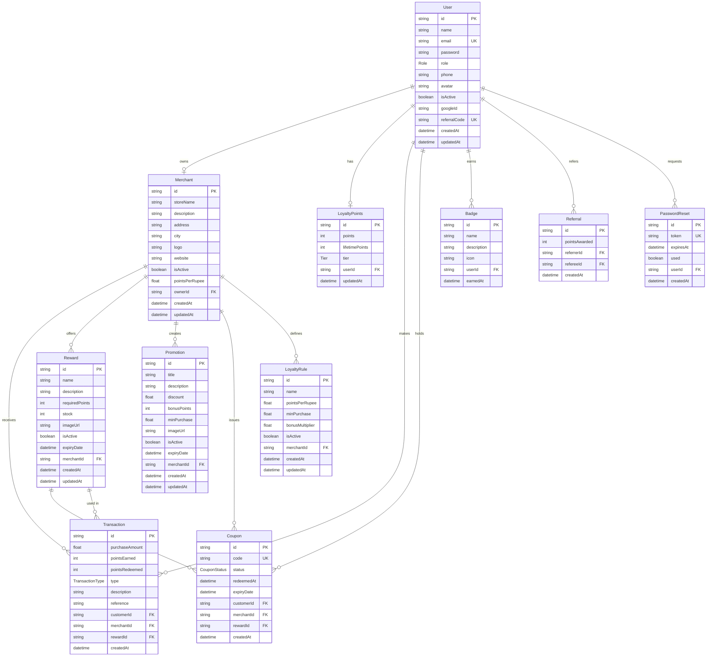

# ER Diagram — LoyaltyHub Database

## Entity Relationship Diagram

---

## Enums

### Role
- `CUSTOMER` — Regular user
- `MERCHANT` — Store owner
- `SUPER_ADMIN` — Platform administrator

### Tier
- `BRONZE` — 0–999 lifetime points
- `SILVER` — 1,000–4,999 lifetime points
- `GOLD` — 5,000–14,999 lifetime points
- `PLATINUM` — 15,000+ lifetime points

### TransactionType
- `EARN` — Points earned from purchase
- `REDEEM` — Points spent on reward
- `REFERRAL_BONUS` — Bonus from referral
- `ADMIN_ADJUSTMENT` — Manual admin change
- `EXPIRY` — Points expired

### CouponStatus
- `ACTIVE` — Valid, not yet used
- `REDEEMED` — Used by merchant
- `EXPIRED` — Past expiry date

---

## Key Relationships

| Relationship | Cardinality | Notes |
|---|---|---|
| User → LoyaltyPoints | 1:1 | Each customer has exactly one wallet |
| User → Merchant | 1:1 | Each merchant account belongs to one user |
| User → Transaction | 1:N | Customer can have many transactions |
| Merchant → Reward | 1:N | Merchant manages their reward catalog |
| Merchant → Promotion | 1:N | Merchant runs multiple campaigns |
| Reward → Coupon | 1:N | Each coupon is generated from a reward |
| User → Referral | 1:N | User can refer multiple friends |
